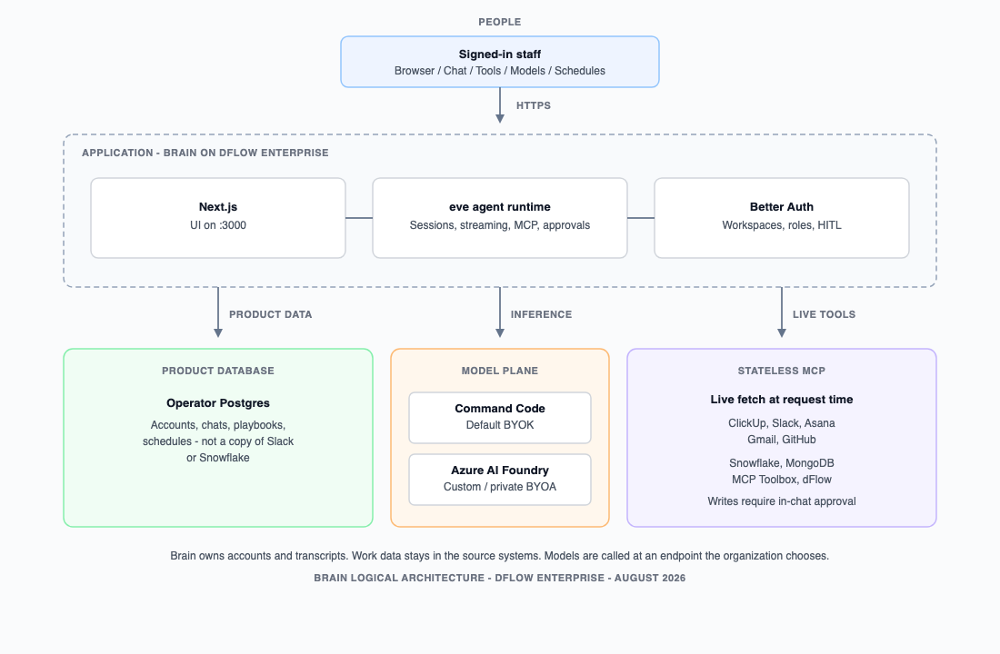

# Technical Architecture: The Brain Platform

**Audience:** Upwardly Global (Upglobe) leadership, operators, and technical stakeholders  
**Status:** PoC architecture overview (product-accurate)  
**Date:** 14 August 2026  
**Product:** Brain `0.1.0-beta` — self-hosted work assistant  
**Deploy:** dFlow Enterprise (Dokku), operator-provided Postgres

This document describes what shipped in the Proof of Concept, why Brain is a private client rather than Claude or ChatGPT, how Azure AI Foundry fits as the model plane, how security and RBAC work, which connectors exist and how more are added, why this is not a RAG application, how MCP connections stay stateless, how team and finance flows were validated, and how the stack is deployed.

---

## 1. What was done

Over roughly two months, Brain was stood up as a **self-hosted browser workspace** for Upglobe: one signed-in chat that can act across the tools the organization already uses, without sending work into a public AI product and without locking the host to Vercel’s platform.

### 1.1 Problem the PoC addressed

Upglobe’s operational systems (project boards, chat, mail, git, warehouse) were live but fragmented. Public AI clients (Claude, ChatGPT) can draft and summarize, but they hold conversation history off-premises and have no first-class, auditable connection to those systems. A typical “RAG chatbot” would copy slices of those systems into a vector index that goes stale. Brain’s PoC is the other design: **a private client, live tools, and a model you control.**

### 1.2 Stack that shipped

| Layer | Choice | Why |
| --- | --- | --- |
| UI | Next.js browser chat | Primary workflow is the browser, not a CLI |
| Agent runtime | eve (`withEve()`) | Durable agent sessions, streaming turns, MCP connections, human-in-the-loop approvals |
| Identity | Self-hosted Better Auth (email/password; optional SSO) | Sessions on the customer host, not Vercel OIDC / Connect |
| System of record | Operator Postgres | Auth, workspaces, chats, playbooks, schedules — no SQLite fallback, no Neon requirement |
| Default models | Command Code (OpenAI-compatible chat completions) | Direct provider; not Vercel AI Gateway |
| Custom / private models | OpenAI-compatible endpoints (including Azure AI Foundry) | BYOA: point Brain at a Foundry (or other) deployment |
| Hosting | Docker image on dFlow Enterprise / Dokku | Self-hostable; production starts eve then Next |

Brain does **not** require Vercel AI Gateway, Neon, Upstash, Vercel Connect, Vercel Sandbox, or `vercel link`.

### 1.3 Product capabilities delivered in the PoC

- **Signed-in chat** with durable history in Postgres (personal and optional shared workspace threads).
- **Workspaces** with invites and roles (instance admin; workspace owner / admin / member).
- **MCP connectors** with per-user, per-workspace grants (Connect from the Tools menu).
- **Tools catalog** — inspect loaded MCP tools without starting a chat turn.
- **Human-in-the-loop** — mutating tools require in-chat approval; Ask mode blocks tools entirely.
- **Playbooks** — named, reusable prompts shared in the workspace.
- **Schedules** — morning brief and playbook schedules, optional Slack delivery.
- **Model picker** — curated Command Code models (workspace-togglable on `/models`) plus instance- and workspace-scoped custom models.
- **Custom models page** — admins register OpenAI-compatible endpoints (Foundry, company proxies, local servers).
- **Production deploy** — Dockerfile → dFlow Enterprise, with operator Postgres and bootstrap of the first operator at `/setup`.

### 1.4 Systems in the Upglobe PoC vs connectors in the product

**Exercised against live Upglobe systems in the PoC:** Snowflake, Asana, Slack, ClickUp, Gmail, GitHub.

**Also shipped in the product** (available to connect; not all were required for the Upglobe PoC): Notion, Linear, Atlassian (Jira/Confluence), Zernio, Sentry, dFlow, MongoDB, MCP Toolbox for Databases, Rybbit, Bytebot.

---

## 2. Why Brain is the client — and why not Claude or ChatGPT

There are two separate reasons. Mixing them is how the previous draft became vague.

### 2.1 Do not put company work in a public AI client

Claude.ai and ChatGPT are **hosted products**. Prompt text, file uploads, and chat history live on that vendor’s infrastructure. For proprietary proposals, HR, finance drafts, or warehouse extracts, that is an unacceptable data-handling posture: the organization does not control retention, residency, training-use policy, or who can later retrieve the thread.

Brain is the **private client**:

- Users sign in to **your** host.
- Chat history, sessions, playbooks, and schedules live in **your** Postgres.
- MCP OAuth tokens are stored on **your** app volume, scoped to the signed-in user and active workspace.
- The organization brings its own model credentials (**BYOK**) and, when needed, its own model endpoint (**BYOA**).

The interface is owned. The data plane is owned. The model can be a third-party API or a private Foundry deployment — that choice is the organization’s, not Anthropic’s or OpenAI’s consumer app.

### 2.2 Why the default model path is not “just call Claude”

Brain’s agent uses **OpenAI-compatible chat completions** (Command Code’s `/chat/completions` path, and the same shape for custom models). Anthropic Claude’s native API is **Messages** (`/messages`), a different protocol. The curated model picker therefore does **not** include Claude ids: they would not run on this provider path.

That is an engineering boundary, not a value judgment about Claude’s quality. If a future host wants Claude, it would need a dedicated Anthropic provider — out of scope for this PoC. What *is* in scope: Command Code’s curated catalog (DeepSeek, GPT, Gemini, and related chat-completions models) **and** any OpenAI-compatible deployment an admin registers — including models hosted in Azure AI Foundry.

### 2.3 What “our own client” means in practice

| Public Claude / ChatGPT | Brain |
| --- | --- |
| History on the vendor’s site | History in operator Postgres |
| No first-class Slack/ClickUp/Snowflake grants | Official MCP connections, user-scoped |
| One vendor’s retention and training policy | Host policy + Foundry (or other) model policy |
| Cannot run inside dFlow Enterprise as *your* app | Deployed as the customer’s application |
| Tools, if any, are that product’s plugins | Tools are the organization’s own systems |

Brain is not a wrapper that still sends every turn through claude.ai. It is the application employees open.

---

## 3. Azure AI Foundry — model plane, not a second chat app

### 3.1 Two planes

| Plane | Who owns it | Job |
| --- | --- | --- |
| **Application (Brain)** | The organization, on dFlow Enterprise | Identity, workspaces, chat UI, MCP tools, approvals, playbooks |
| **Model (Azure AI Foundry)** | The organization’s Azure tenant | Deploy, govern, fine-tune, and filter models; optionally train custom weights |

Brain does **not** train models inside the Next.js app. Training, fine-tuning, evaluation, and content-filter policy belong in Foundry (or an equivalent private model host). Brain **consumes** those models the same way it consumes Command Code: an OpenAI-compatible base URL, a model id, and an optional API key, registered on the Models page (instance-wide or per workspace).

That split is the point. A RAG chatbot trains *the application* to look smart by stuffing documents into a prompt. A Foundry-centered design trains or governs **the model** (and the network path to it), then lets the application call **live systems**.

### 3.2 Why Foundry instead of usage-only public endpoints

Usage-only APIs (a key against `api.openai.com` or a consumer Claude key) are enough to demo chat. They are a weak enterprise control plane:

| Capability | Usage-only public API | Azure AI Foundry |
| --- | --- | --- |
| Network isolation | Traffic to a public SaaS | Private networking, tenant boundary, optional private endpoints |
| Content filters / risk policies | Vendor defaults | Customer-configured filters and logging |
| Custom / fine-tuned models | Limited or none | First-class custom model deployments |
| Agent instructions at the model host | Prompt-only in the app | Foundry-side configuration plus Brain playbooks |
| Key and quota governance | One scattered API key | Azure RBAC, quotas, deployments per environment |
| Data used for provider training | Contract-dependent | Customer Azure terms and deployment settings |

Command Code remains a valid default for the PoC (fast to stand up, no Azure dependency to get chat working). Foundry is the **strategic** model home: when Upglobe wants inference to stay inside Azure, admins add that deployment as a custom model and select it in the picker. Chat still works if Command Code is unset, as long as a usable custom model exists for the workspace.

### 3.3 How Brain attaches to Foundry

1. Instance admin (host-wide) or workspace owner/admin (one workspace) opens **Models**.
2. They create a custom model: label, OpenAI-compatible **base URL** (Foundry’s chat-completions-compatible endpoint), **provider model id**, optional API key, context window.
3. API keys are stored server-side and **never returned to the browser**.
4. Members see the model in the picker; they never see the key.
5. The next chat turn calls that endpoint. Invalid or deleted ids fall back to Command Code (if configured) or another visible custom model.

Foundry advantages therefore accrue **without** Brain becoming an Azure-only product. The same BYOA path works for a company proxy, LM Studio, or another OpenAI-compatible host.

---

## 4. Security architecture and guardrails

Self-hosting is the foundation: Brain runs as the customer’s application. Guardrails are layered on top of that, not replaced by a slogan about “Zero Trust” or “never leaving Azure.” Azure residency applies **when the selected model is a Foundry deployment in that tenant**. Turns that use Command Code leave the Brain host toward Command Code; that is an explicit BYOK choice.

### 4.1 Identity and sessions

- Better Auth email/password sessions (Postgres).
- First host: `/setup` (or bootstrap script) creates the operator; production requires `BRAIN_BOOTSTRAP_TOKEN`.
- Optional workspace SSO (OIDC/SAML) and SCIM when licensed — not required for the PoC default (invite-only signup).
- Unauthenticated clients cannot create agent sessions or read another user’s chats or tools.

### 4.2 Tenancy

- **Workspace** is the tenancy unit (not “org”).
- Session carries `userId` + active `workspaceId`.
- Chats, playbooks, schedules, and MCP grants are scoped to the active workspace.
- Switching workspace does not leak the previous workspace’s grants or threads.

### 4.3 Secrets and credentials

| Secret | Where it lives | Who sees it |
| --- | --- | --- |
| Better Auth secret, DB URL, bootstrap token | Host env (dFlow config) | Operators only |
| Command Code / Foundry API keys | Env or encrypted custom-model store | Never sent to the browser |
| OAuth app client id/secret (Slack, Asana, Gmail, GitHub) | Host or workspace BYOA | Instance admin / workspace admin |
| OAuth **grants** (access tokens) | App volume, keyed by user + workspace + provider | That user in that workspace |
| Snowflake PAT, MongoDB/Toolbox bearer | Workspace (or host/env fallback) | Admins who set them up |

### 4.4 Tool guardrails (human-in-the-loop)

MCP tools that **create or mutate** work (tasks, issues, comments that change work, deploys, writes) require **in-chat user approval** before they run. Reviewed read/list/get tools may skip approval. **Unknown tool names fail closed** (require approval). There is no “always allow” memory in this PoC.

**Ask vs Agent mode:** Ask answers in natural language only and **denies all connection tools**. Agent is the default operational mode.

### 4.5 What is stored vs what is fetched

Postgres holds **Brain’s own product data** (users, workspaces, chat transcripts, playbooks, schedules). It does **not** hold a copy of Slack, ClickUp, or Snowflake as a search index. When the agent needs current work, it calls MCP. That is both a security property (less replicated sensitive data) and a freshness property (see §7–§8).

### 4.6 Durable storage — what is not used

Brain requires `BRAIN_DATABASE_URL` (or `DATABASE_URL`). If Postgres is missing or down, the app fails clearly. It does **not** fall back to SQLite files under `.eve/` for auth or chats.

---

## 5. Connectors, how to add more, and RBAC

### 5.1 Connectors shipped

| Connector | Typical use | How it authenticates |
| --- | --- | --- |
| ClickUp | Tasks, lists, search | Official MCP + OAuth DCR (no env client secret) |
| Slack | Channels, messages, playbook delivery | Official MCP + OAuth (app id/secret in UI or env) |
| Asana | Projects and tasks | Official MCP + OAuth (app id/secret) |
| Gmail | Read / draft mail | Official MCP + Google OAuth client |
| GitHub | Repos, issues, PRs | Official MCP + OAuth (app id/secret) |
| Notion | Pages and databases | Official MCP + OAuth DCR |
| Linear | Issues and projects | Official MCP + OAuth DCR |
| Atlassian | Jira, Confluence, Compass | Official MCP + OAuth DCR |
| Zernio | Social / ads / messaging | Official MCP + OAuth DCR |
| Sentry | Issues, traces | Official MCP + OAuth DCR |
| dFlow | Apps, deploys, logs | Official MCP + OAuth DCR |
| Snowflake | SQL / Cortex / warehouse | Managed MCP URL + PAT |
| MongoDB | Query and schema | Streamable HTTP MCP URL + optional bearer |
| MCP Toolbox | SQL / databases via MCP Toolbox for Databases | Streamable HTTP MCP URL + optional bearer |
| Rybbit | Analytics, sites, goals | Streamable HTTP MCP URL + required API key |
| Bytebot | Desktop computer-use | HTTP MCP URL + optional bearer |

**PoC live set:** Snowflake, Asana, Slack, ClickUp, Gmail, GitHub.

### 5.2 Two layers of connector access

1. **App registration (optional BYOA)** — client id/secret or MCP URL/PAT. Instance admin sets host-wide defaults; workspace owner/admin may override with workspace BYOA. Ordinary members cannot change app credentials.
2. **User grant (Connect)** — each member authorizes **their** Slack/ClickUp/… account in **that** workspace. User A’s token is never used as user B. A grant in workspace A is not used in workspace B.

Resolution order for app credentials: workspace BYOA → host-stored → env → DCR when the provider supports it.

DCR providers (ClickUp, Notion, Linear, Atlassian, Zernio, Sentry, dFlow) usually need no app-secret setup: members Connect. Snowflake / MongoDB / Toolbox / Rybbit / Bytebot are Set up (URL + token), not OAuth Connect.

### 5.3 How more connectors are added

Brain is built to grow by **the same three patterns**, not by a one-off integration framework:

| Pattern | Use when | Examples |
| --- | --- | --- |
| Official remote MCP + OAuth DCR | The vendor publishes MCP and supports dynamic client registration | ClickUp, dFlow, Notion |
| Official remote MCP + static OAuth app | The vendor requires a pre-registered client id/secret | Slack, Asana, Gmail, GitHub |
| Streamable HTTP MCP URL (+ bearer or PAT) | The customer hosts or is issued an MCP server | Snowflake, MongoDB, MCP Toolbox, Rybbit, Bytebot |

Adding a connector means: define the connection (URL, auth, read-vs-write approval list), list it in the Tools catalog, and store credentials with the same workspace isolation. Any vendor that speaks MCP can be added this way — including additional databases via MCP Toolbox’s `tools.yaml`, additional warehouses, or internal OpenAPI-wrapped MCP servers. Brain does not require Vercel Connect connector UIDs.

The Tools catalog exists so users can see **which tools actually loaded** after Connect, without burning a model turn.

### 5.4 RBAC in detail

**Instance (whole Brain install)**

| Role | Capabilities |
| --- | --- |
| Instance admin | First `/setup` user. License/policies (signup mode, whether users may create workspaces, auto personal workspace). Host-wide OAuth app credentials. Instance-scoped custom models. |

Self-host default signup mode is **invite-only**. Open signup is a policy the instance admin can enable; it is not required.

**Workspace**

| Role | Capabilities |
| --- | --- |
| Owner | Full admin, plus delete/transfer team workspace. Cannot leave if last owner. |
| Admin | Invite/remove members (not owners); workspace BYOA; workspace custom models; workspace settings; SSO/SCIM when licensed. Cannot transfer ownership. |
| Member | Chat; Connect/Disconnect **own** MCP grants; use playbooks/schedules; cannot change BYOA, invites (as inviter of record depends on policy), or models. |

**Data visibility**

| Data | Scope |
| --- | --- |
| Personal chats | `workspaceId` + `userId` |
| Shared chats | `workspaceId` (team members) |
| Playbooks and schedules | Workspace library |
| MCP grants | `workspaceId` + `userId` + provider |
| Custom model keys | Server only; instance or workspace scope for *visibility* of the model, never of the key |

This is more than “a workspace checkbox.” It is how finance can share a Snowflake-backed thread without giving every member the PAT, and how a contractor in workspace B cannot see workspace A’s Slack grant.

---

## 6. Bleeding edge: not a RAG app

Most enterprise “AI assistants” are RAG: copy documents into a vector database, retrieve chunks, stuff them into the prompt. That architecture is a poor fit for live operations.

### 6.1 Why RAG is the wrong default here

- **Stale by construction.** Slack, ClickUp, and Snowflake change continuously. Re-indexing is operationally heavy and still lags.
- **A second copy of sensitive data.** The vector store becomes another system to retain, redact, and breach.
- **Token-expensive and developer-heavy.** Every schema change or new source is an ETL project.
- **It trains the application, not the model.** The org invests in pipelines instead of in a governed model and live tool access.

### 6.2 What Brain does instead

1. **Live tools.** The agent calls MCP at request time (current tasks, current warehouse query, current deploy).
2. **Governed / custom models.** Fine-tuning, filters, and private deployment live in Azure AI Foundry (or another BYOA host). That is training and governing **the model**, not stuffing the Next.js app with embeddings.
3. **Databases stay databases.** Snowflake (warehouse), MongoDB (document), and MCP Toolbox (SQL sources defined in Toolbox) are queried live. Brain does not ingest those stores into a product-owned vector index.
4. **Brain’s own memory is the transcript + playbooks**, in Postgres — durable product data, not a cache of customer systems.

There is **no** Redis-like “BetterDB” agent-memory cache in Brain, and no SQLite chat sidecar. Draft language that described a 30–45 day Redis memory window is not part of this architecture. Persistence of *Brain* data is Postgres; freshness of *work* data is MCP.

### 6.3 When retrieval still makes sense

Foundry (or Snowflake Cortex Search, or a Toolbox tool) may still perform retrieval **inside the model or data platform**. That is retrieval as a capability of the system of record, not Brain running a parallel RAG stack. If Upglobe later wants a dedicated search index, it should live next to the data (warehouse / Foundry), not as a silent copy inside the chat app.

---

## 7. MCP connections are stateless

Older MCP integrations often held a **long-lived session** (SSE) on the server: tool state, working-set, and sometimes cached resources lived in that session. That model is a poor match for a multi-user, multi-workspace host and for data that must be correct *now*.

Brain’s connectors use **remote MCP over Streamable HTTP** (and vendor-equivalent HTTP MCP). Practically:

- **No Brain-side replica** of Slack channels or Snowflake tables is kept as session memory.
- **Tokens are durable; data is not.** OAuth/PAT material is stored so the user does not re-Connect every turn. The *payload* (messages, rows, tasks) is fetched when the tool runs.
- **Workspace isolation is request-scoped.** Grant lookup uses the current user + active workspace on that turn.
- **HTTP MCP URL connectors** (MongoDB, Toolbox, Snowflake via proxy) resolve the upstream URL **per workspace** at request time, so two workspaces can point at two servers without a sticky MCP session.

“Stateless MCP” therefore means: each tool call is an authenticated fetch of **current** system state, not a conversation with yesterday’s index. That is what makes morning briefs and finance reports safe to run on a schedule — they see the board and the warehouse as they are at run time.

---

## 8. Team and finance validation

These are the PoC **validation scenarios** exercised (or designed to be exercised) with live connectors — not hypothetical ROI slogans. They are the tests that matter for Upglobe: team operations and finance reporting against real systems.

### 8.1 Team / leadership

| ID | Scenario | Connectors | What “pass” looks like |
| --- | --- | --- | --- |
| T1 | Morning brief | ClickUp, Slack, Gmail, Asana (as connected) | A scheduled or forced run creates a persisted chat: due/blocked work, important Slack, mail that needs a reply — not a dump of every item |
| T2 | Sprint blockers | ClickUp and/or Asana | Agent lists blocked or overdue items from the live board (not a CSV export) |
| T3 | Slack nudge | Slack | After approval, a message is posted to the configured channel using **that user’s** Slack grant |
| T4 | Inbox triage | Gmail | Agent summarizes what needs a reply; drafts stay drafts until the user approves mutating tools |
| T5 | Playbook reuse | Any | A named playbook runs the same prompt later without retyping; stored in the workspace library |
| T6 | Ask vs Agent | Any | Ask mode answers without calling tools; Agent proposes tool calls and waits on writes |

### 8.2 Finance / operations

| ID | Scenario | Connectors | What “pass” looks like |
| --- | --- | --- | --- |
| F1 | Live warehouse question | Snowflake | Answer comes from a live MCP/SQL/Cortex call, not a spreadsheet attached to the chat |
| F2 | Repeatable report | Snowflake + playbook | The same playbook can be re-run or scheduled; numbers reflect current warehouse state |
| F3 | Credential isolation | Snowflake | Members chat using workspace-configured PAT; they never see the PAT in the browser |
| F4 | Write safety | Snowflake / Toolbox | Mutating or unreviewed tools stop for approval; Ask mode cannot query via tools |

### 8.3 Cross-cutting

| ID | Scenario | What “pass” looks like |
| --- | --- | --- |
| X1 | Workspace switch | Tools and chats from workspace A do not appear in B |
| X2 | Second user | User B cannot use user A’s Slack/ClickUp grant |
| X3 | Deploy health | dFlow connection can list apps / flag failed deploys (when connected) |
| X4 | Foundry or custom model | Selecting a custom OpenAI-compatible model completes a turn without Command Code if that custom model is the only provider |

Failures that are **expected** (and not product bugs): a disconnected MCP app, an expired OAuth grant (user Re-Connects), missing Snowflake URL/PAT (admin Set up), or Ask mode refusing tools.

---

## 9. Deployed on dFlow Enterprise

Brain is deployed as a Dockerized Next.js + eve application on **dFlow Enterprise** (Dokku-compatible). Production and testing are separate instances so agent changes can ship without a shared-tenant PaaS.

### 9.1 Runtime shape

The image builds with `eve build && next build`. At start, `scripts/start-production.mjs`:

1. Starts the eve Nitro server (local `:4274`).
2. Waits until it is healthy.
3. Starts Next on `:3000`.

`withEve()` proxies `/eve/v1/*` to that local eve process. If eve never binds, chat fails with connection refused — a healthy deploy shows eve up, then Next, and `/eve/v1/health` succeeding.

### 9.2 Required configuration

| Variable | Purpose |
| --- | --- |
| `BRAIN_DATABASE_URL` | Operator Postgres 16+ (auth, workspaces, chats, playbooks, schedules) |
| `BETTER_AUTH_SECRET` | Session signing |
| `BETTER_AUTH_URL` / `BRAIN_PUBLIC_URL` | Public origin for cookies and OAuth `redirect_uri` |
| `BRAIN_BOOTSTRAP_TOKEN` | First operator at `/setup` (required in production) |
| `COMMAND_CODE_API_KEY` | Default models (optional if custom Foundry models are registered) |

Optional: `BRAIN_INTERNAL_TOKEN` / `BRAIN_INTERNAL_URL` for server-side callbacks; SMTP for invite email; per-provider OAuth client env as fallback when UI Set up is not used.

MCP OAuth tokens live under `.eve/` on the app filesystem — that directory must be on a **persistent volume** so Connect survives deploys.

### 9.3 Operator sequence

1. Provision Postgres; set `BRAIN_DATABASE_URL`.
2. Set Dokku/dFlow builder to **Dockerfile** (not herokuish).
3. Set ports `http:80:3000` (TLS terminator as usual for the enterprise host).
4. Set config/secrets listed above.
5. Deploy from git.
6. Open `/setup` with the bootstrap token; create the operator.
7. Sign in, create/invite the team workspace, Connect MCP apps, optionally register a Foundry custom model.

Schema is applied on boot against an empty database. There is no SQLite → Postgres migration.

### 9.4 Why dFlow Enterprise for this PoC

- The application stays **the customer’s process** on **the customer’s (or contracted) host**.
- Production and testing instances are first-class, without a Vercel project link.
- The same image runs locally (Docker) and in enterprise.
- dFlow is also a **Brain connector**: operators can ask the agent about deploys and logs using the same MCP pattern as Slack or GitHub.

---

## 10. Logical architecture

Brain sits in the middle of three planes. The browser talks only to Brain. Brain stores **its own** product data in Postgres, calls a **model endpoint** the organization chooses, and reads or writes **live work systems** through stateless MCP (with approval on writes). It does not copy Slack or Snowflake into a vector index.

| Plane | What lives there | What does not |
| --- | --- | --- |
| Product data (Postgres) | Accounts, transcripts, playbooks, schedules | Copies of Slack, ClickUp, or warehouse tables |
| Models | Command Code (default) or Azure AI Foundry (BYOA) | The Brain UI itself |
| Live tools (MCP) | Current tasks, mail, deploys, SQL at request time | A stale RAG index inside Brain |

---

## 11. Honest boundaries (PoC)

- Brain is **beta**. It is a self-hosted work assistant, not a replacement for ClickUp, Snowflake, or Azure.
- Default chat can use Command Code; **Azure-only inference** requires registering a Foundry (or other private) custom model and selecting it.
- Native Anthropic Messages / Claude-as-provider is **not** wired.
- SSO/SCIM exist in the product model when licensed; the PoC default is Better Auth + invites.
- “Always allow this tool” is out of scope; every mutating call can prompt again.
- This document does not claim a proprietary BetterDB cache or SQLite ChatStore — those are not in the architecture.

---

## Related operator material

- In-app customer docs: `/docs` on a running host (including `/docs/self-hosting/architecture`).
- README architecture section and diagram: `docs/brain-architecture-diagram.png`.
- Deploy runbook: `docs/deploy-dokku.md`.
- Auth and tenancy design: `docs/superpowers/specs/2026-08-06-brain-auth-tenancy-design.md`.
