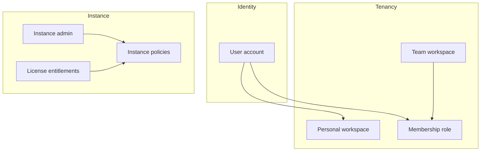

# Brain auth & tenancy design

**Status:** Product decisions locked (discussion complete). Not an implementation checklist.  
**Branch context:** Builds on host Better Auth + per-user data on `feat/multi-user-auth`.  
**Date:** 2026-08-06  

One product model for **Brain Cloud**, **self-host**, and **enterprise**. Behavior differs by **license entitlements** + **instance policies**, not separate codebases.

---

## Why auth exists

Auth answers:

1. **Identity** — who is acting (`userId`)
2. **Tenancy** — which workspace is active (`workspaceId`)
3. **Authorization** — what they may change (chats, Connect, BYOA apps, invites, instance settings)
4. **Isolation** — data and secrets do not leak across users or workspaces

Today (pre-workspace): identity + host operator + per-user chats/MCP grants exist; membership, invites, and workspaces do not.

---

## Naming

| Term | Meaning |
| --- | --- |
| **User** | Login identity (email/password or SSO) |
| **Workspace** | Tenancy unit in UI and code (`workspaceId`) |
| **Membership** | User’s role in a workspace |

Do **not** use “org / organization” in product copy. Prefer **workspace** everywhere (UI + code).

---

## Model B (all deploy modes)

- Every user gets an automatic **Personal workspace** when instance policy allows.
- Users may **create** additional workspaces and/or **join** via invite.
- There is no separate “personal account type” vs “org account”: personal is a workspace the user owns alone.
- Session carries `userId` + active `workspaceId`; UI provides a workspace switcher.
- Multiple workspaces per Brain install in all modes.

---

## Deploy modes (same model, different defaults)

| | **Brain Cloud** | **Self-host** | **Enterprise** |
| --- | --- | --- | --- |
| Who runs host | Brain operator | Customer | Customer (often private) |
| First user | Sign up → User (+ personal workspace) → create/join | `/setup` → User + instance admin + workspaces | Bootstrap or IdP admin |
| Default signup mode | `open` | `invite-only` | `sso-only` |
| Open signup if enabled | Yes | **Yes** (policy) | **Yes** if license/policy allow |
| Join workspace | Invite and/or create | Invite and/or create (if policy) | SSO placement, invite, and/or create |
| Data plane | Managed DB (future) | Local SQLite / volume (today) | Customer DB / VPC (future) |

---

## Roles

| Role | Scope | Capabilities |
| --- | --- | --- |
| **Instance admin** | Whole Brain install | License, instance policies, host-level settings. First `/setup` user starts here. |
| **Workspace owner** | One workspace | Delete/transfer workspace; billing if scoped to workspace |
| **Workspace admin** | One workspace | Invite/remove members; workspace MCP BYOA; workspace settings |
| **Member** | One workspace | Chat; Connect/Disconnect own MCP grants |

Today’s host `operator` / first auth user maps forward to **instance admin** (and owner of initial workspace(s)).

**Who may create workspaces:** default **any signed-in user** (becomes owner). Instance admin may disable via policy when the license allows that control.

---

## License vs instance policies

| Kind | Purpose | Examples | Where it lives |
| --- | --- | --- | --- |
| **License entitlements** | Commercial SKU caps / unlocked capabilities | Max users, SSO available, multi-workspace, which policy knobs exist | Signed **license key** (self-host/enterprise paste); cloud may use same tables without customer paste UI |
| **Instance policies** | How this install behaves day to day | Signup mode, auto personal workspace, allow create workspace | Instance admin **settings UI** / DB |

Do **not** encode every checkbox inside the license string. License unlocks knobs; admin sets policies within those knobs.

### Illustrative instance policies

- Auto-create personal workspace for every user: on/off  
- Users may create new workspaces: on/off  
- Signup mode: `open` | `invite-only` | `sso-only`  
- (Later) allow workspace BYOA, require BYOA, invite permissions, etc.

---

## Invites and signup

- Creating a **User** ≠ joining a **team workspace**.
- **Invites:** workspace owner/admin invites to a specific workspace (optional email bind). Accept → membership; Personal workspace remains (Model B).
- **Signup mode** (`open` / `invite-only` / `sso-only`) is an instance policy on **all** modes — not hard-coded off for self-host/enterprise.
- Self-host or enterprise **may enable open signup** when they want it.
- **SSO:** enterprise default `sso-only` (password signup off). SCIM / auto workspace placement = later phase.
- Cloud after sign up: personal workspace auto-created; user may create a team workspace or accept an invite.

---

## MCP connections

Two layers:

| Layer | What | Who configures |
| --- | --- | --- |
| **OAuth app** | Client id/secret + redirect URI | **Platform** default, or **workspace BYOA** override |
| **OAuth grant** | User’s connected token | Each member via **Connect** (`workspaceId + userId + provider`) |

**Resolve order** (workspace + provider):

1. Workspace BYOA credentials if present  
2. Else platform app (Brain Cloud apps, or instance/env apps on self-host)  
3. Members Connect/Disconnect only their own grant  

**Who Sets up BYOA:** workspace owner/admin.  
**Not default:** per-user OAuth apps (each user pasting client secrets).  
**DCR providers** (ClickUp/dFlow): usually no app layer → Connect only.

Instance policy/license may later: allow BYOA, require BYOA, hide platform apps.

---

## Data ownership (option B)

| Data | Ownership | Keying |
| --- | --- | --- |
| Chats | Personal within active workspace | `workspaceId + userId` (private) |
| Playbooks | Workspace shared library | `workspaceId` |
| Schedules / morning brief | Workspace shared | `workspaceId`; runs use configured member Connect / run-as |
| MCP Connect grants | Personal within workspace | `workspaceId + userId + provider` |
| MCP OAuth apps | Platform or workspace BYOA | platform / `workspaceId` |

Personal workspace (single member): same schema; “shared” playbooks/schedules are effectively that user’s.

**Not v1:** workspace-visible shared chat threads.

---

## First implementation slice

Ship before full license UI, SSO, and cloud multi-tenant DB:

1. **Workspaces + membership** on current self-host (SQLite) — Model B personal workspace, create/switch workspace, migrate today’s per-user data into a default workspace  
2. **Invites** + signup-mode policy (`open` / `invite-only`) — no SSO yet  
3. **Scope data** to `workspaceId` (chats personal; playbooks/schedules workspace-shared)  
4. **MCP:** keep platform/env + host setup; add workspace BYOA when ready  
5. **Later:** license entitlements UI, SSO, cloud multi-tenant DB, instance admin settings polish  

---

## Out of scope for this design doc

- Concrete schema migrations and API shapes (OpenSpec change when implementing)  
- License cryptography details  
- Provider-specific OAuth app registration runbooks beyond existing connection docs  

---

## Related

- Current auth/operator code: `lib/auth/`  
- Chat UI design: [2026-07-29-brain-chat-ui-design.md](./2026-07-29-brain-chat-ui-design.md)  
- OpenSpec main specs: `openspec/specs/` (update via change proposal when implementing)  
